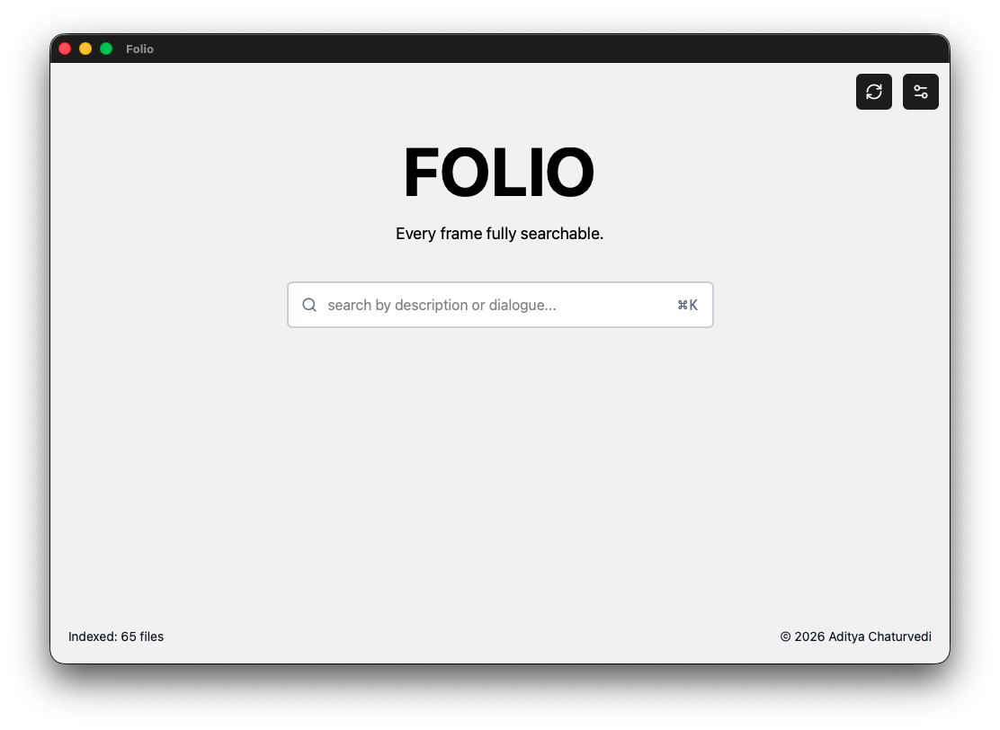
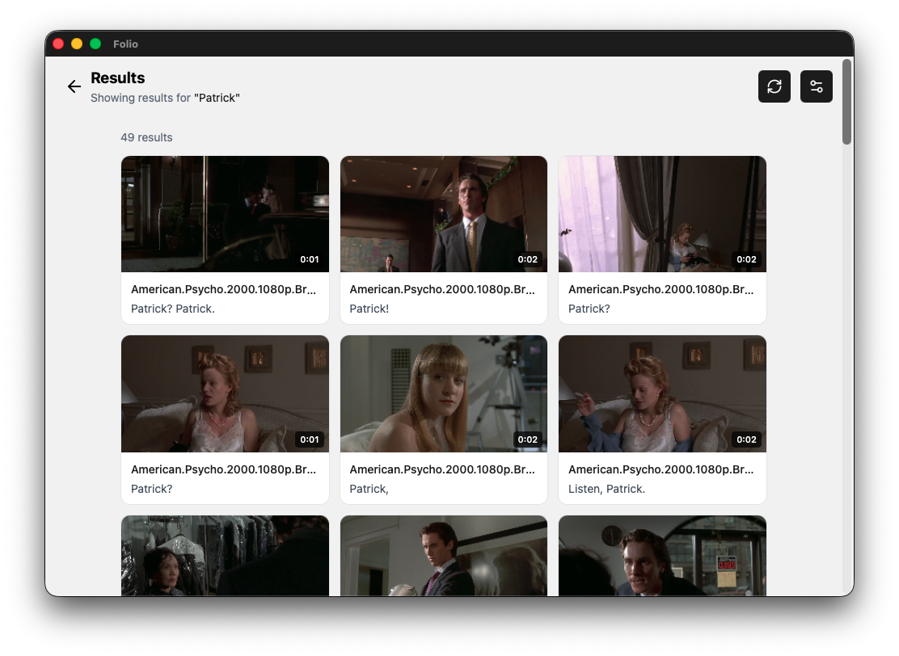
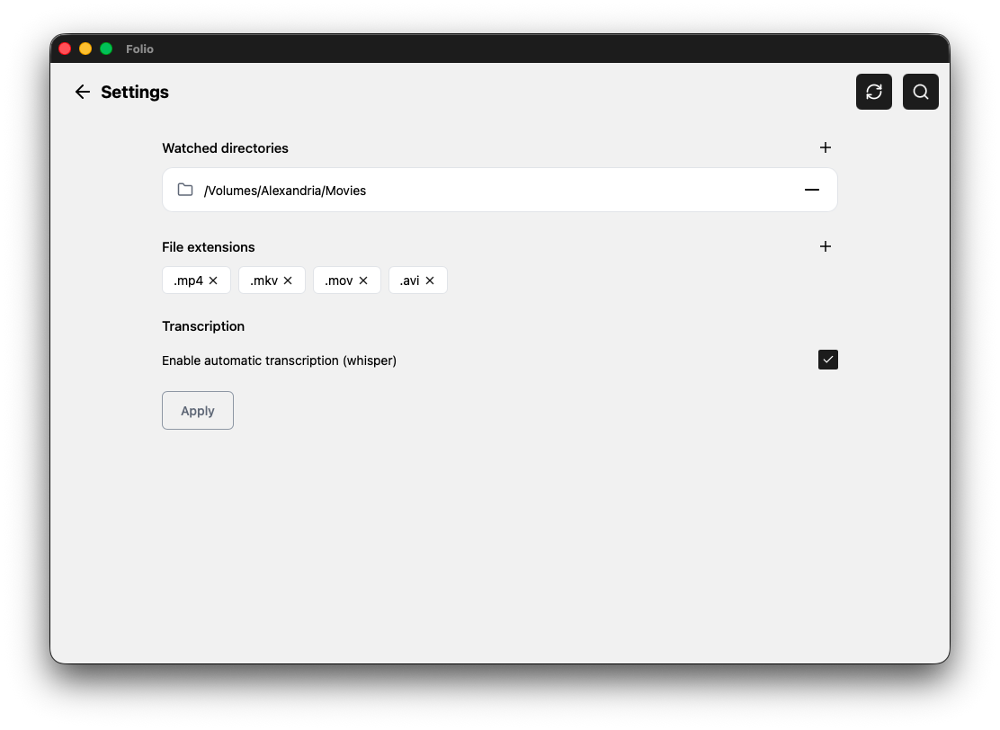

# Folio

Folio is a simple app that helps you search videos on your computer by the content. You can search by dialogue or by what is happening in a scene. It also supports semantic search, so you do not need to type exact words every time.

Everything stays private and it works offline, which makes it ideal for documentaries, interviews, and any editing workflow where you need to quickly look through lots of footage.

It is built with Rust and Svelte, so it stays fast, efficient, and lightweight as a single binary.

<br />
<br />
<div align="center">
  <p>Home page</p>
  
  <br />
</div>

<div align="center">
  <p>Results for a simple query</p>
  
  <br />
</div>

## Table of Contents

- [Folio](#folio)
  - [Table of Contents](#table-of-contents)
  - [Getting Started](#getting-started)
    - [Installation](#installation)
    - [Build](#build)
  - [Usage](#usage)
  - [Project Structure](#project-structure)
  - [Contributing](#contributing)
  - [License](#license)

## Getting Started

### Installation

```bash
git clone https://github.com/grapesalt/folio.git
cd folio
bun install
```

### Build

```bash
bun run tauri build
```

## Usage



1. Open the settings in the app.
2. Add folders in the watched directories.
3. Click apply and let indexing finish.
4. Search with normal language and open the matching clips.

Tip: use broader phrases first, then narrow down.

## Project Structure

```text
.
├─ src/                 # Frontend
├─ src-tauri/           # Rust Backend
```

## Contributing

Contributions are welcome.

1. Fork the repository.
2. Create a feature branch.
3. Make your changes.
4. Open a pull request with a short summary.

## License

This project is licensed under GPL-3.0. See [LICENSE](LICENSE.md)
